# Documentation - Audio Zones

[Main](../) > Documentation - Audio Zones

# Contents

- [Script Info](#script-info)
  - [Features](#features)
- [Installation](#installation)
  - [Creator Companion](#creator-companion)
  - [Unity Package](#unity-package)
- [Examples Location](#examples-location)
- [Audio Occlusion](#audio-occlusion)
  - [Adding Audio Occlusion](#adding-audio-occlusion)
  - [Custom Audio Settings](#custom-audio-settings)
- [Audio Channels](#audio-channels)
- [Audio Boost](#audio-boost)
  - [Area](#area)
  - [Pickup](#pickup)
- [Toggleable Audio Barrier](#toggleable-audio-barrier)
- [Toggle Audio Zones System](#toggle-audio-zones-system)
- [Audio Blocking Layer (Advanced)](#audio-blocking-layer--advanced-)
  - [Audio Block Only](#audio-block-only)
  - [Wall Replacement](#wall-replacement)

# Script Info

Audio occlusion system for player voices and avatars.

## Features

- Block the audio of player and avatars behind objects like walls.
- Easy to toggle the system by turning the manager on/off.
- Audio boost area/pickups, ideal for DJs or event staff.
- Audio channels to segregate player audio.

# Installation

Download the package files from [PayHip](https://payhip.com/b/lEJRc).

The download comes with 2 versions, Creator Companion (`VRC CC.zip`) and a Unity Package (`PACKAGE.unitypackage`). The Creator Companion version is recommended.

**!!! - ONLY INSTALL 1 VERSION - !!!**

## Creator Companion

Creator Companion Install: [Package Install - VRChat Creator Companion](https://docs.google.com/document/d/1u4XdBijIuOShECT0Nvwb43c_BHeK4vfTMugFvlvQO54/edit)

## Unity Package

Unity Package Install: [Package Install - Unity Package](https://docs.google.com/document/d/1yboKFSFRh2EmqESxKq5EaR8c1rdlEN4MOUtkxcWexD8/edit)

# Examples Location
Some parts of the documentation will refer to files inside the examples directory. See below for how to find them.

Unity Package install examples this will be under: `Assets\RiskyKen\Udon\Utils\Audio Zones\Examples`  

Creator Companion install examples will be under: `Packages\RiskyKen - Audio Zones\Examples`  

## Audio Occlusion

Audio occlusion will block the sound of player voices and avatars if they are behind a solid object like a wall.

### Adding Audio Occlusion

Find the `Audio Zones - Manager` prefab then drag it into your scene.

Now right click it and select `Unpack Prefab`.  
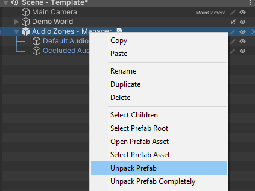

Lets select the manager and look over some of the options.  

**Update Rate Fast & Slow**  
How long in seconds between player's getting their audio settings updated. Default value `0.00625 = 0.5 / 80` so in a world of 80 players it will take 0.5 seconds for every players audio to get updated. Slow default 0.025 is 2 seconds.

**Target Frame Rate**  
If the frame rate falls below this value the slow update rate will be used otherwise the fast update rate is used.

**Default Audio Channel**  
Default audio channel for players.

**Occlusion Mask**  
What layers Audio Zone will check when determining if a player is behind a wall. *(note adding a lot of layers may hurt performance)*

**Default Audio Settings**  
Audio settings applied to remote players that are **not** occluded.

**Occluded Audio Settings**  
Audio settings applied to remote players that are  occluded.

**Effectors**  
List of audio effectors in the world.  

***Any time an effector *(audio area or audio pickup)* is added or removed from the world, `Auto Fill Effectors` must be pressed.***

### Custom Audio Settings

Select `Default Audio Settings` under the audio zones manager.  

Here we can adjust player voice and avatar audio settings. The settings here are the VRChat defaults. If you ever want to change the audio settings for your world change them here, Audio Zones will override settings from other scripts.  

You can find a detailed description of each option on the VRChat wiki [player audio page](https://docs.vrchat.com/docs/player-audio) or by reading the tooltips.

Next select `Occluded Audio Settings`.  
  

These are the settings used when a player is behind an audio blocking object like a wall. If you would like the player's voice to still be slightly audible when occluded, increase the voice far and voice gain values by a small amount otherwise leave everything at 0.  

## Audio Channels

Audio channels can segregate audio between players without the need for a wall between them. By default all players start in audio channel 0, this can be changed on the audio zone manager if you like.

First drag in the `Audio Zones - Area` prefab into your scene, unpack the prefab then move it to the location you want.  

When selecting the object we can see all the settings for this audio area. Change the audio channel value to a new number like 1. The edit collider button on the box collider can be used to change the size of the zone.  

Finally select the manager object and press the `Auto Fill Effectors` button.  

## Audio Boost

An audio boost or dampen can be applied to areas or pickups, this is ideal or event staff, DJs or a quiet zone.

### Area
First drag in the `Audio Zones - Area` prefab into your scene, unpack the prefab then move it to the location you want.

Now drag in an `Audio Zones - Audio Settings` prefab. Increase the voice gain and voice far on the audio settings. I am using gain 20 and far 100 for this example but you should experiment with different values to find ones that work for your use case.  

Now select the area and drag the audio settings we just created into its `Audio settings Override` slot. Remember to set a higher priority value if this area is overlapping with others.  
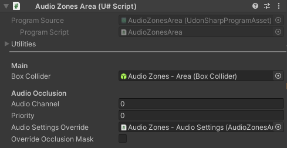

Finally select the manager object and press `the Auto Fill Effectors` button.  

### Pickup

There is a pickup prefab included called `Audio Zones - Microphone`, you can drag this in or add the script to an existing pickup by selecting it and pressing Add Component and searching for `Audio Zones - Pickup`.  
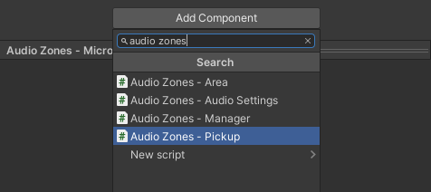

Now drag in an `Audio Zones - Audio Settings` prefab. Increase the voice gain and voice far on the audio settings. I am using gain 20 and far 100 for this example but you should experiment with different values to find ones that work for your use case.  
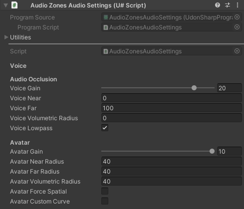

Now select the pickup and drag the audio settings we just created into its `Audio Settings Override` slot and drag the VRC Pickup component into the `Pickup` slot. Because pickups can be moved around the world, set a high priority value so no other effectors will interfere with it.  
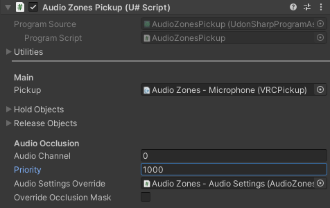

Finally select the manager object and press the `Auto Fill Effectors` button.  

## Toggleable Audio Barrier

An audio barrier can be used to toggle audio occlusion in an area, please read the [Audio Channels](#audio-channels) section first.

To set up we will need a script that can toggle objects, I will be using my free [Object Toggle Tool](https://payhip.com/b/vWHRJ) script but any toggle script will work.

First drag setup an audio channel area the same as in [Audio Channels](#audio-channels). Place it over the area you want the audio toggled. (normally a room to block the sound of people outside and vice versa)

In my example below players on the white floor can’t hear others in the rest of the world.  
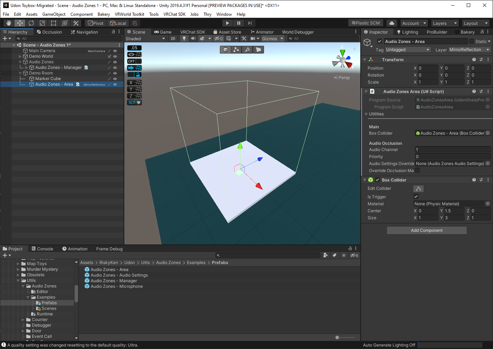

Now all we need to do is make a toggle button to toggle the audio zone area.

For my example I will create a basic button using a cube, scaled down to 0.1 size and its layer set to walkthrough.  

Now add the toggle script to the button.  

Finally we will add the audio area to the toggle objects. I also added some interaction text and set materials for the buttons on and off state.  
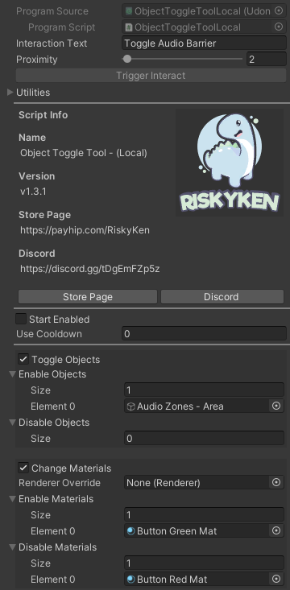

## Toggle Audio Zones System

The audio zones manager can be toggled to shut off the audio occlusion system. This can be a nice option to provide to players in your world.

If you already have a toggle script then simply toggle the manager object, below I will show making a toggle button using my free [Object Toggle Tool](https://payhip.com/b/vWHRJ) script.

I will create a basic button using a cube, scaled down to 0.1 size and its layer set to walkthrough.  

Now add the toggle script to the button.  

Finally we will add the audio zone manager to the toggle objects. I also added some interaction text and set materials for the buttons on and off state.  
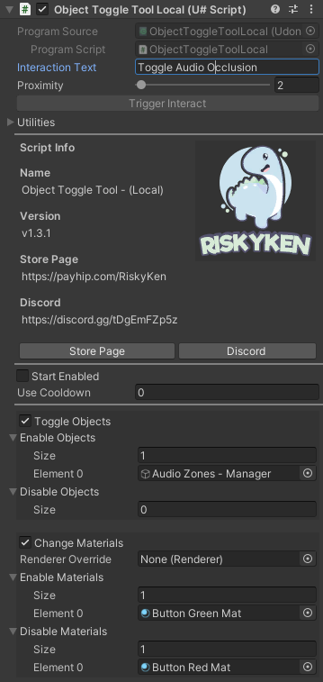

## Audio Blocking Layer (Advanced)

***This section is unfinished.***  

By default Audio Zones will use objects on the default layer to block audio between players.

Using the default layer is fine for worlds with simple geometry or that will only have a small number of players. However if you are building a world with complex geometry, a large player cap or strict performance requirement, a custom audio blocking layer can be used for better performance and control of Audio Zones.

There are 2 ways a custom audio layer can be setup.

### Audio Block Only

### Wall Replacement

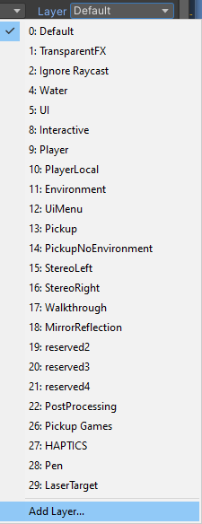

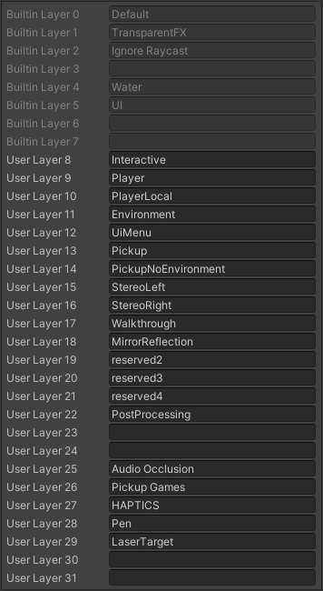

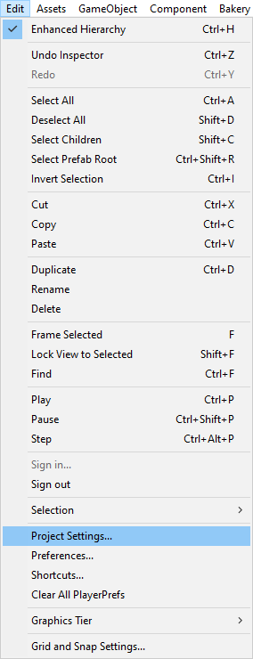

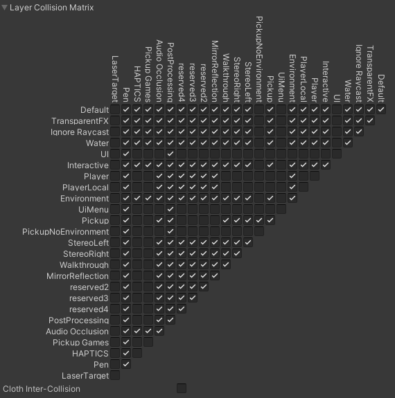

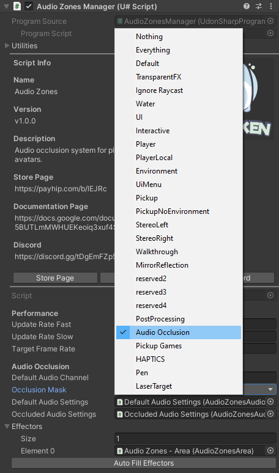
