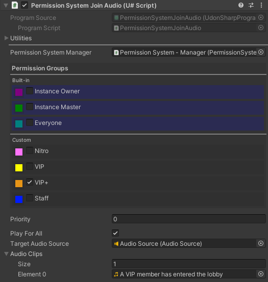
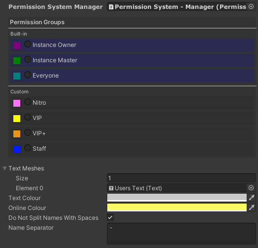
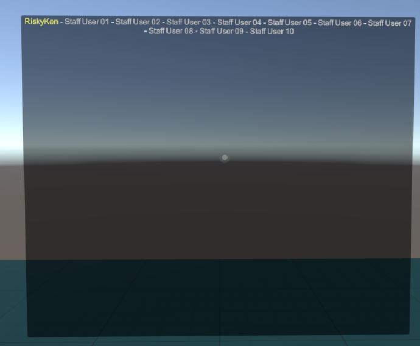
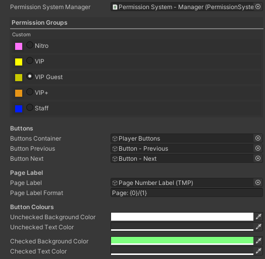
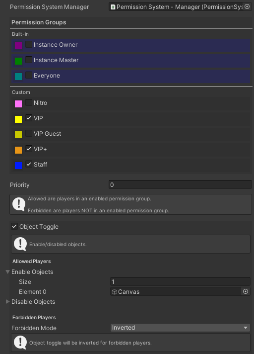

# Documentation - Permission System

[Main](../) > Documentation - Permission System

# Contents

- [Script Info](#script-info)
  - [Features](#features)
- [Installation](#installation)
  - [Creator Companion](#creator-companion)
  - [Unity Package](#unity-package)
- [Examples Location](#examples-location)
- [Setup](#setup)
  - [Manager](#manager)
  - [Groups](#groups)
  - [Actions](#actions)
  - [Join Audio](#join-audio)
  - [Display Wall](#display-wall)
  - [Guest Access](#guest-access)
  - [Permission Priorities (Advanced)](#permission-priorities-advanced)

# Script Info

Script to handle permissions of players in a world.

## Features

**Custom Groups**

- Create any number of custom groups for Staff, VIPs, Supporters, Friends or whatever you like.
- Build in instance master and instance owner groups. Ideal for game worlds.

**World Actions**

- Toggle Game Objects
- Change intractability of buttons (script and UI)
- Change Materials
- Change Meshes
- Press Buttons
- Call Events
- Change Tooltips
- Toggle Colliders
- Update Animator Bool
- Change UI Text Colour
- Change UI Image Colour
- Change UI Toggle State

**Join Audio**

- Play different audio file when players from different groups join the world.

**Group Display**

- Displays a list of all the players in a group.
- Highlight group players that are in the world.

**Guest Access**

- Give players temporary access to a group.

# Installation

See [Install Guides](https://riskyken.github.io/Udon-Documentation/Install%20Guides/) for installation instructions.

# Examples Location

Some parts of the documentation will refer to files inside the examples directory. See below for how to find them.

Unity Package install examples this will be under: `Assets\RiskyKen\Udon\Utils\Permission System\Examples`  

Creator Companion install examples will be under: `Packages\RiskyKen - Permission System\Examples`  

# Setup

The below steps will show you how to setup the permission system and use it's features. I recommend fully reading both the [Manager](#manager) and [Groups](#groups) sections before jumping ahead. Most of the sections below also have example scenes in `Examples\Scenes` if you prefer learning that way.

## Manager

To get started first we need a manager.

Find the `Permission System - Manager` prefab then drag it into your scene.

Now right click it and select `Unpack Prefab`.  

**Notes:**

- There should only ever be 1 permission manager in a world.

## Groups

Now we need some groups to split players into, like Staff, VIPs or Supporters.

Find the `Permission System - Group` prefab and drag it in also and unpack it. You can place your groups anywhere in the hierarchy, I am placing mines as a child of the manager to keep things organised.

You should now rename the group, for this example I am going to name mines Staff.  

Now select the new group you just created.  

The first option here links to the 2nd script on this object. We can use this to link a text file to load usernames from. The text file should have 1 username per line `Examples/User Lists` has some example files. For this example I am going to drag the staff list in.  
  
A URL can also be used allowing usernames to be updated without reuploading the world. If both a file and URL are set the script will use the file contents until the URL is downloaded.

The other option here colour is purely for organization, I recommend setting a different colour for each group but it's not required.

Now that we have created 1 group we can easily make more by right clicking our first group and selecting duplicate. Doing this I have created 3 new groups. Create any groups you need, don't forget to change the text file or URL for the new ones.  

The final thing we need to do is select the manager and press `Auto Fill Groups` all your groups should now show in it's permission groups section.  

#### **!!! --- Important Notes --- !!!**  
- Some URLs will only work if the player has untrusted URLs turned on, check [here](https://creators.vrchat.com/worlds/udon/string-loading/) for more information.
- VRChat replaces the letters in some usernames. (example Full Stops are replaced with [One Dot Leader](https://www.compart.com/en/unicode/U+2024)) Because if this I recommend copy pasting usernames form the VRChat website.  

- Any time groups are added or removed the `Auto Fill Groups` button should be pressed on the manager to update it's group list.
- There are also 3 build in groups instance master, instance owner and everyone.

## Actions

Now that we have a manager and groups we can add actions to edit the world for players of different groups.

For this example I have create a small world with 3 "rooms", players can only enter the staff and VIP rooms by clicking on the doors to teleport them. We will setup actions to restrict what players can use the teleports.  

First create a new object.  (I like creating all my actions inside one object for organization but you can create them anywhere you like)  
  
Now rename the new object, I am calling mines `Staff Door Action`.

Now select it and press `Add Component` then search for and add `Permission System - Action`.  

Now you should see a large number of options available to you.  
  
Most of the options here should be self explanatory, when checked they will also provide some extra information.

There are a few way we could stop players entering the staff room like turning off the door or it's collider. For this example lets turn off it's intractability so the door is still visible and has a collider. First at the top check the groups we want to have access, for me that will be staff. Next check `Change Interacts` and drag the door into the `Enable Interacts` array.

The final result should look like this.  

Now that we have one action setup we can duplicate it and quickly setup another one for the VIP door.  
  
This time we let staff and both VIP ranks access the door.

With this you can see the power of the action script and all the options it provides. Try playing about with some of it's different options but I would not recommend changing the priority or forbidden mode options until you have read [Permission Priorities (Advanced)](#permission-priorities-advanced)

**Notes:**

- The teleport I used in this example is part of my core package. Check [here](https://riskyken.github.io/Udon-Documentation/RiskyKen%20Core/#teleport) if you want to learn how to set it up.

## Join Audio

The join audio script can be used to play an audio file when a member of a group joins the world.

Find the `Permission System - Join Audio` prefab and drag it in also and unpack it. Now select it and press the `Auto Set Manager` button.

Now we can select an audio to play in audio clips and set the groups we want this audio to play for.  

The `Play for All` check box will, play the join audio for all players when someone joins.

The other option here priority is used if the player is in more than 1 group. An example use could be having separate join audio for staff and VIPs, if a player was on both list the audio with the higher priority number would be used.

**Notes:**

- There are 2 version of the prefab for local (only audible near the script object) or global (audible everywhere) audio.
- More than one audio clip can be set for variety, the script will randomly select one. This is not synced and will be random for each person. Blank elements and also be used for a random chance to play audio.

## Group Display

A group display can be used to display all the players in a group, ideal for displaying a list of your supporters. Group display can also highlight the names of players in the world.

Find the `Permission System - Group Display` prefab and drag it in also and unpack it. Now select it and press the `Auto Set Manager` button.
`Permission System - Group Display`

Now simply select the group you want to display and we are done.  
  

- The 2 colour options will change the username text colour if a group member is in the world.
- Do not split names with spaces will prevent word wrap for usernames with spaces.
- Name separator is the text used to split names apart in the list.  

**Notes:**

- If you want to display the same group in mutable places it's better for performance to use 1 group display and link more texts into it's text meshes array.
- Please keep this in mind that updating UI text is an expensive operation in Unity, spamming 500 group displays in your world is maybe not the best idea.

## Guest Access

Guest access can be used to temporarily give players access to a group until they leave the world. This could be used for things like supporters giving their friends access to VIP areas or staff letting a DJ access stream controls.

Find the `Permission System - Guest Access` prefab and drag it in also and unpack it. Now select it and press the `Auto Set Manager` button.

Now we can select what group the players will be temporarily added to.  
  
Creating a separate group for guests is not required but it is recommended.

The colour options at the bottom can be used to better theme the button display for your world.

The last things we will want to do it restrict what players can use the guest access panel so people can't give themselves guest access. We can easily do this with a permission system action by toggling the guest access child canvas object.

**Never turn of the main guest access object, this would stop the script form syncing correctly.**  
  

**Notes:**

- Guests players will not show in group displays, this is intentional.

## Permission Priorities (Advanced)

***This section is unfinished.***  